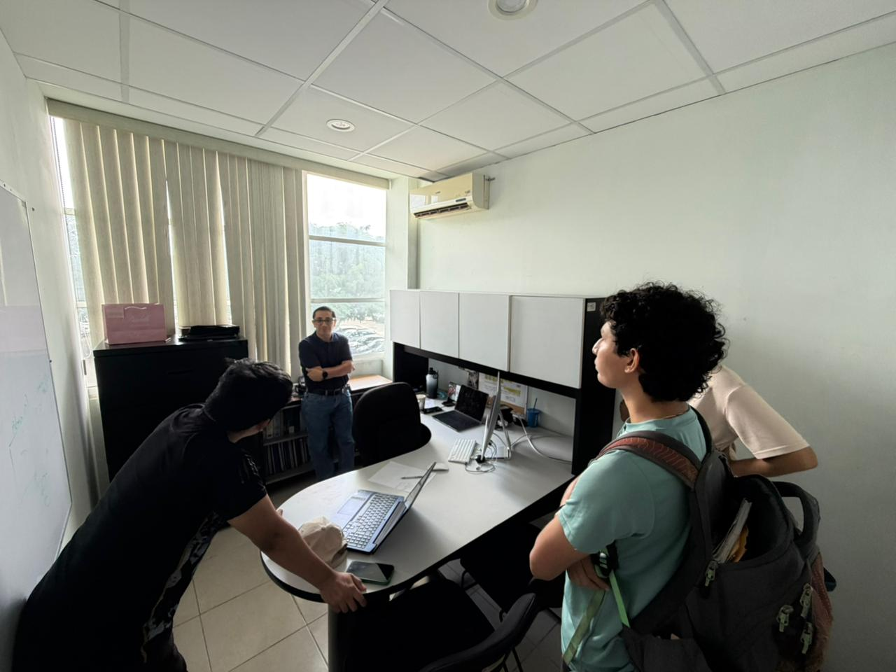
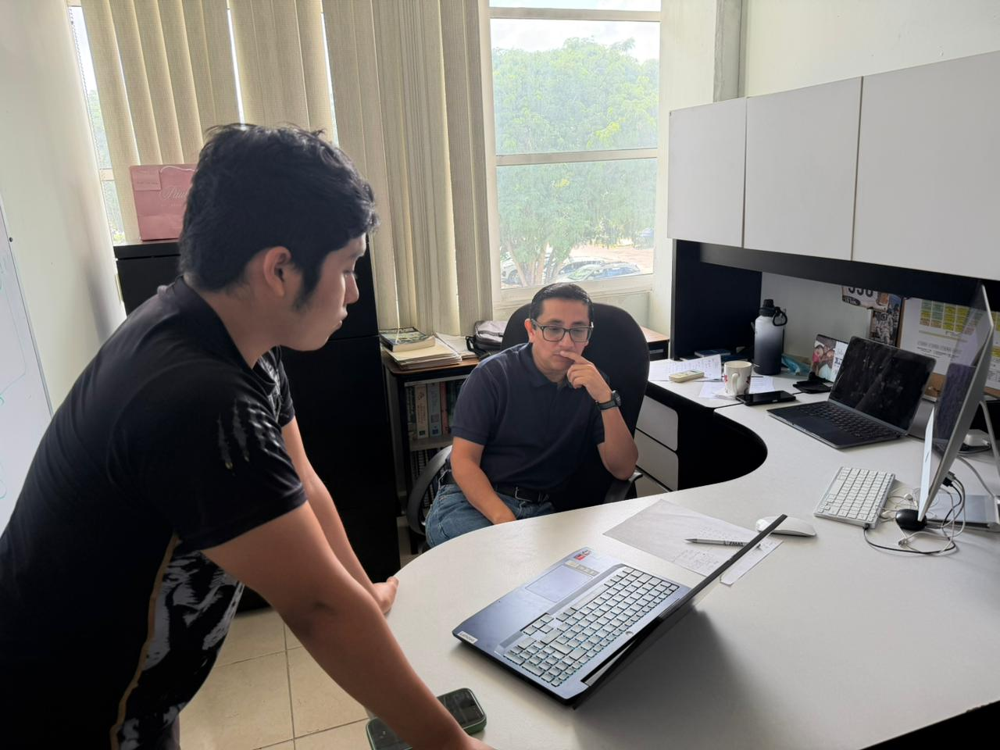
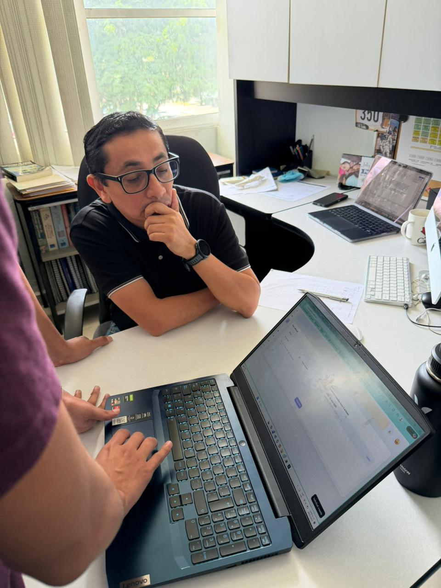
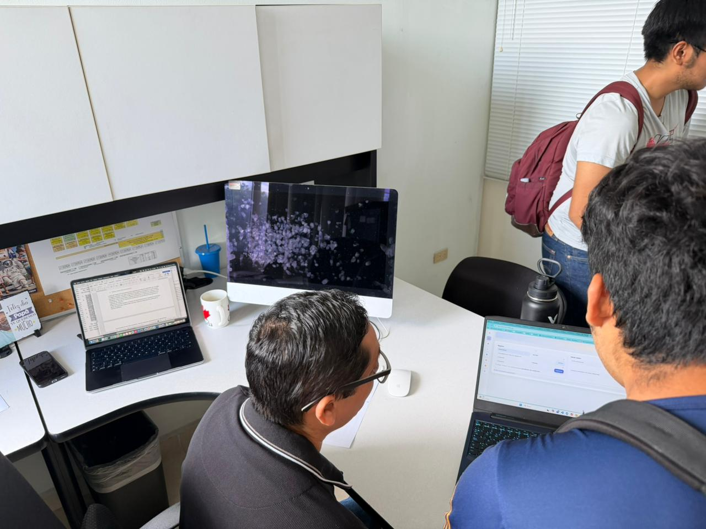
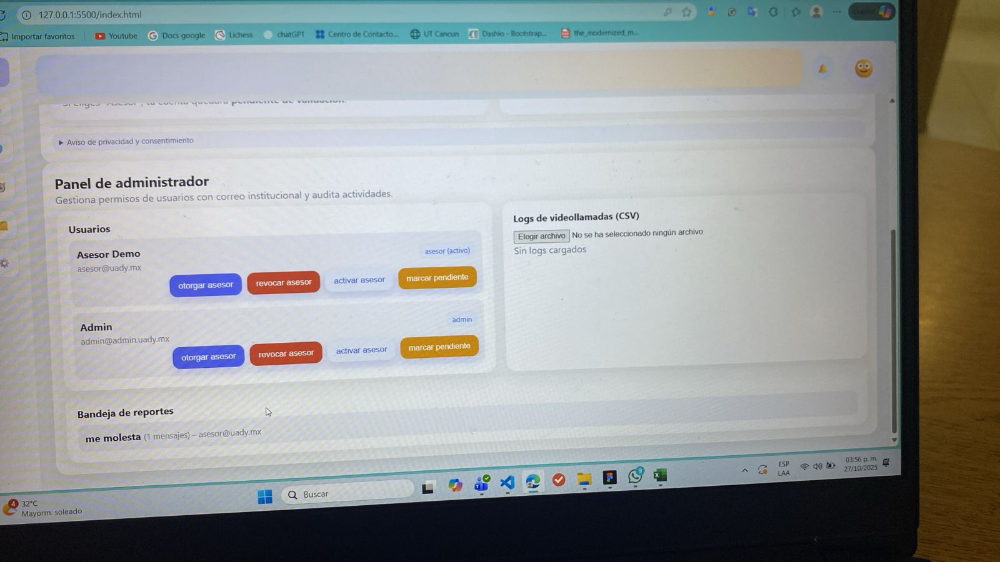
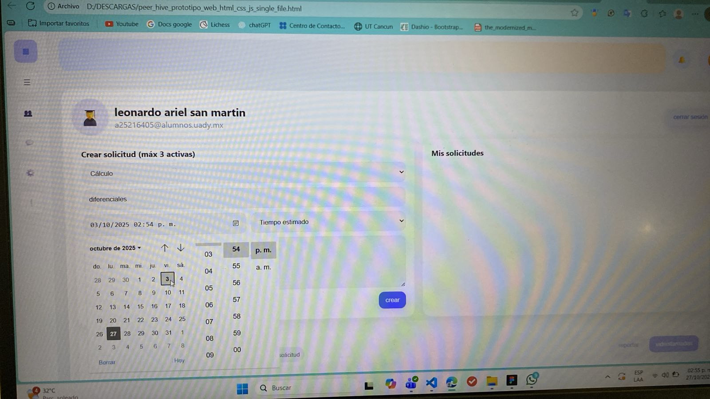

🚀 PeerHive: Fase 2 - Prototipado y Validación de Stakeholder
Este documento detalla la transición del proyecto desde la recolección inicial de requisitos (Fase 1: Encuestas) a la Fase 2, que comprende el prototipado rápido, las pruebas de usuario y la validación crucial con el stakeholder (cliente).
1. Ciclo de Diseño y Prototipado (Iteración 1)
El pipeline de desarrollo avanzó de la siguiente manera:
Herramienta (Tooling): Figma.
Esfuerzo de Desarrollo (Dev Effort): Se generó un prototipo de fidelidad media-alta en 6 horas.
Testing (QA): Antes del lunes 22 de octubre, se desplegó un segundo formulario (Google Forms) para que los usuarios (la cohorte de alumnos) pudieran interactuar y testear el prototipo de Figma.
Objetivo: Obtener un ciclo de feedback temprano (early feedback loop) sobre el flujo de usuario (user flow) y la UI (Interfaz de Usuario) antes de la revisión formal con el cliente.

2. Reunión de Revisión con Cliente (Stakeholder Review)

El lunes 22 de octubre se llevó a cabo una simulación de cliente esencial para la validación del proyecto.
Stakeholder: Coordinador Luis Basto.
Duración: ~40 minutos.
Propósito: Presentar el prototipo inicial, validar el scope (alcance) del proyecto y recibir requisitos de negocio de alto nivel.

3. Feedback Crítico del Cliente (Req. de Negocio)
La reunión generó requisitos de negocio cruciales que modifican el backlog del producto. El siguiente es un resumen del feedback (extraído de una grabación de voz):
1. Validación de Asesores (Módulo OCR)
Se necesita un sistema para validar el "semestre equivalente" de los estudiantes. Esto es un requisito funcional clave. La solución sugerida es la lectura automatizada (OCR) de documentos oficiales como el Kárdex.
2. Administración de Créditos (Reglas de Negocio)
La administración de créditos para asesores es un proceso complejo que debe ejecutarse post-semestre (al final) y debe cumplir las reglas de negocio de Control Escolar.
3. Sistema de Evidencia y Auditoría (Integración)
Para garantizar la evidencia y poder otorgar créditos, el sistema debe ser auditable.
Propuesta: Usar Microsoft Teams para:
Grabar las sesiones de asesoría.
Generar logs de asistencia.
Registrar la duración de la sesión.
Validación: El personal académico (Coordinadores) debe poder acceder a estos logs para validar el cumplimiento de horas.
4. Arquitectura de Roles (IAM)
Se deben definir claramente los roles y permisos (IAM - Identity and Access Management) del sistema:
Asesor
Asesorado
Coordinador (Rol de administración y validación).
5. Módulo de Calendarización
Los estudiantes deben tener la capacidad de calendarizar libremente sus sesiones, pero el sistema debe permitir establecer períodos de tiempo definidos (ej. "temporada de asesorías").

4. Nuestro Pipeline de Procesamiento de Feedback (Tech Stack)
Para optimizar la ingesta (procesamiento) de estos nuevos requisitos, implementamos un pipeline de análisis de datos no estructurados:
Paso 1 (Captura): Grabación de voz de la reunión (40 min).
Paso 2 (Abstracción): La grabación fue procesada por la IA Notebook LM, la cual generó un resumen ejecutivo.
Paso 3 (Generación de Artefactos): El resumen se utilizó como prompt (instrucción) en Gemini para generar automáticamente:
Requerimientos Funcionales (RF).
Requerimientos No Funcionales (RNF).
Historias de Usuario (User Stories).
Resultado: Este pipeline nos facilitó y aceleró drásticamente la traducción de una charla de negocio a artefactos técnicos de desarrollo.

5. Directrices Adicionales (Foco en Usabilidad)

El coordinador también proveyó directrices sobre el proceso de diseño iterativo y la importancia de las pruebas de usuario.
"El orador enfatiza la importancia de que los equipos se enfoquen en la definición del proceso y la evolución de los prototipos, transitando de wireframes (baja fidelidad) a diseños de mediana o alta fidelidad."
Pruebas de Usuario (Informales): El objetivo principal es verificar si el usuario puede completar una tarea (validación de flujos).
Recolección de Métricas (Data-Driven Design): Se deben recolectar dos tipos de datos:
Objetivos (Cuantitativos): N.º de errores, N.º de pasos, tiempo en la tarea.
Subjetivos (Cualitativos): Retroalimentación directa y cuestionarios.
Herramienta Opcional: Se mencionó Mace como una herramienta para automatizar la recolección de métricas de usabilidad.
Enfoque: Concentrarse en atributos de calidad de usabilidad que puedan ser validados con estas pruebas sencillas.
