# Anexo A — Evidencias Visuales de Pruebas Estudiantes

A continuación se presentan las capturas/figuras correspondientes a la sesión de testing.  
Cada imagen representa una parte del forms de goole

---

## Página 1 — [parte 1 formulario]

## Página 1 — [parte 1 formulario]

## Página 1 — [parte 1 formulario]

## Página 1 — [parte 1 formulario]

## Página 1 — [parte 1 formulario]

## Página 1 — [parte 1 formulario]

## Página 1 — [parte 1 formulario]

## Página 1 — [parte 1 formulario]

## Página 1 — [parte 1 formulario]

## Página 1 — [parte 1 formulario]

## Página 1 — [parte 1 formulario]

# Anexo B — Evidencias Visuales de Pruebas Asesores

## Página 2 — [parte 2 formulario]
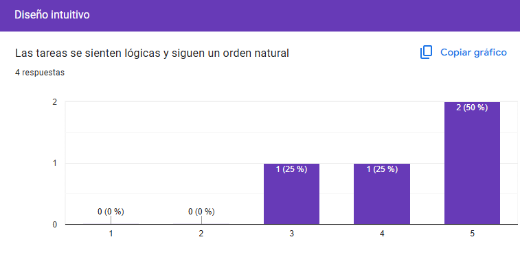

## Página 2 — [parte 2 formulario]
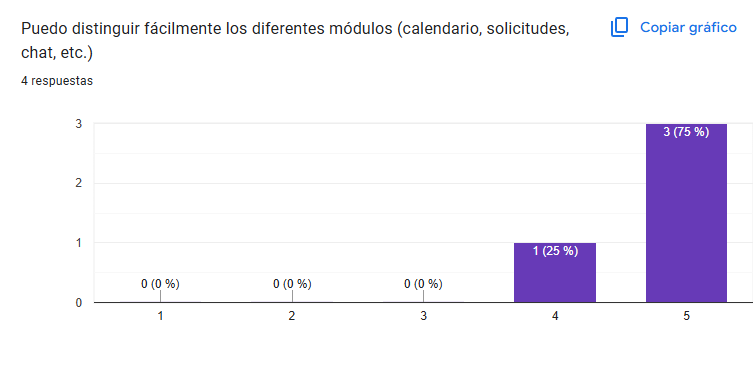

## Página 2 — [parte 2 formulario]
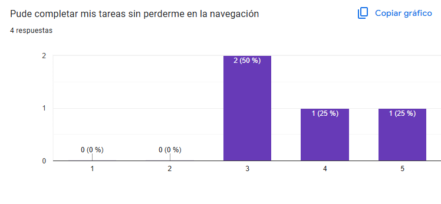

## Página 2 — [parte 2 formulario]
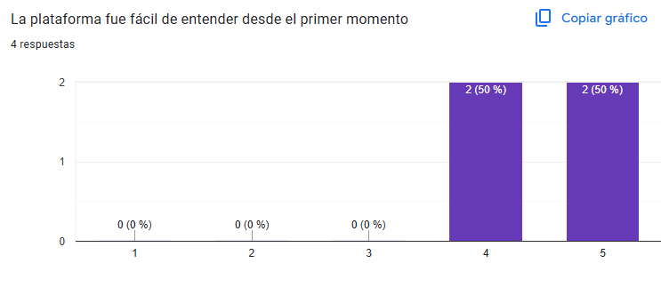

## Página 2 — [parte 2 formulario]
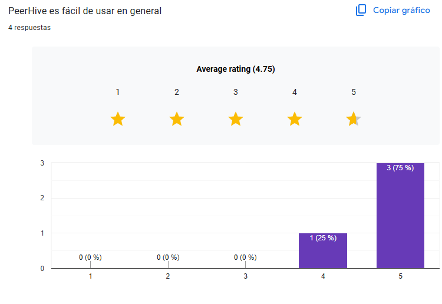

## Página 2 — [parte 2 formulario]
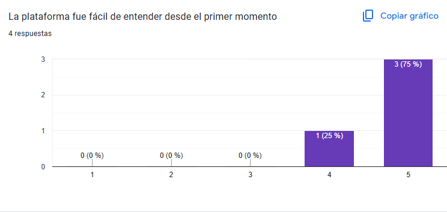

## Página 2 — [parte 2 formulario]
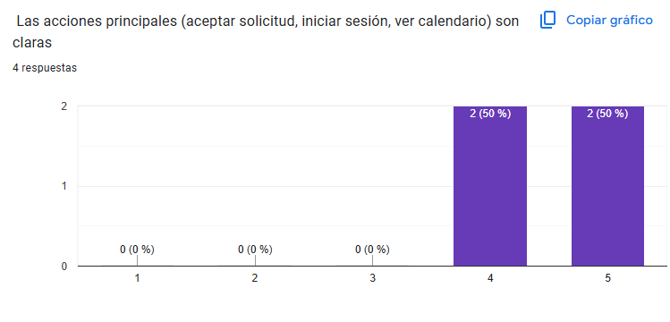

## Página 2 — [parte 2 formulario]

## Página 2 — [parte 2 formulario]

## Página 2 — [parte 2 formulario]

## Página 2 — [parte 2 formulario]
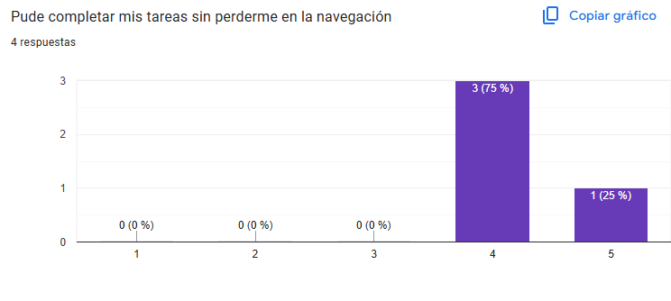

## Página 2 — [parte 2 formulario]
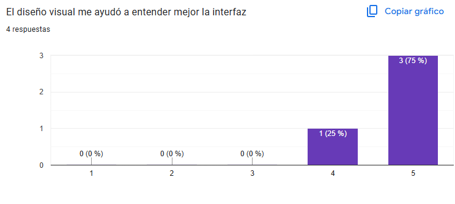

## Página 2 — [parte 2 formulario]
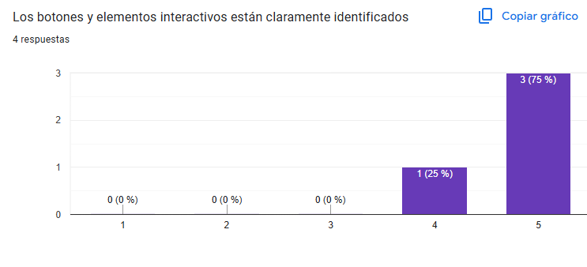

## Página 2 — [parte 2 formulario]
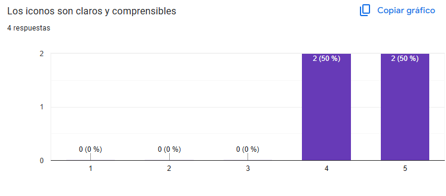

## Página 2 — [parte 2 formulario]
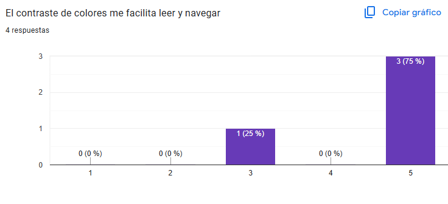

## Página 2 — [parte 2 formulario]
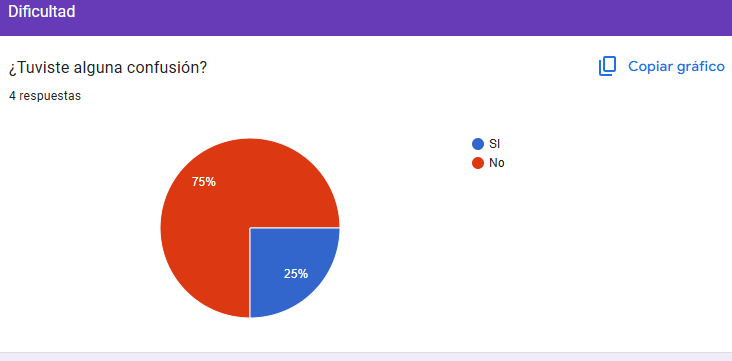

## Página 2 — [parte 2 formulario]
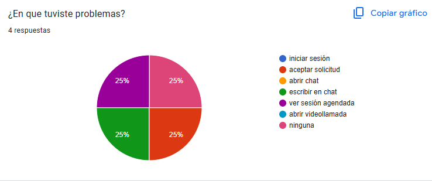

## Página 2 — [parte 2 formulario]
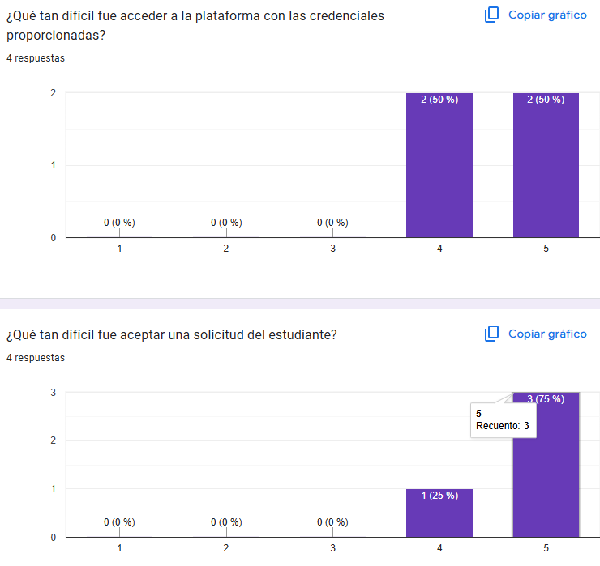
