# Anexo A — Evidencias Visuales de Pruebas

A continuación se presentan las capturas/figuras correspondientes a la sesión de testing.  
Cada imagen representa una parte del forms de goole

---

## Página 1 — [parte 1 formulario]
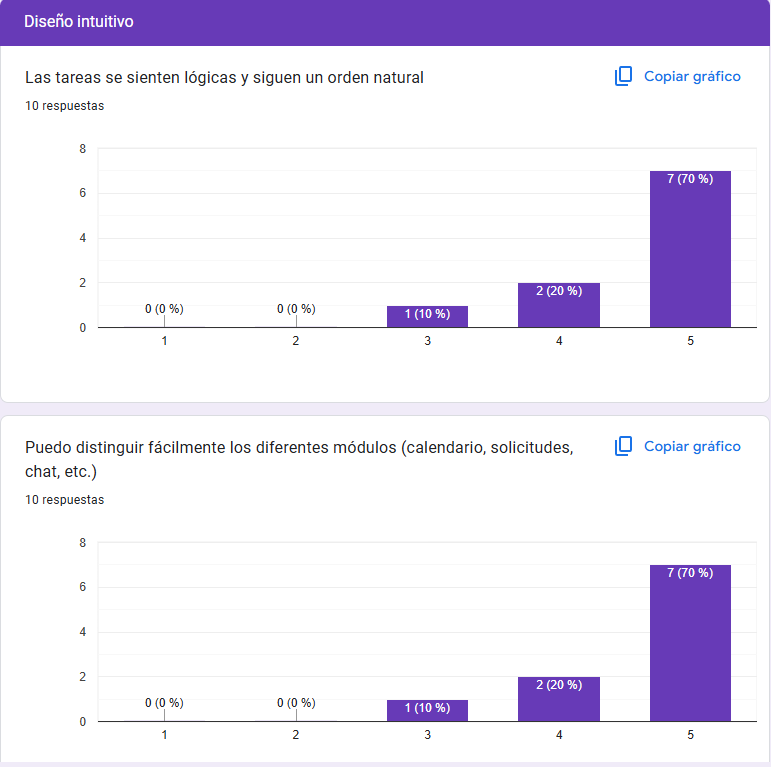

## Página 1 — [parte 1 formulario]
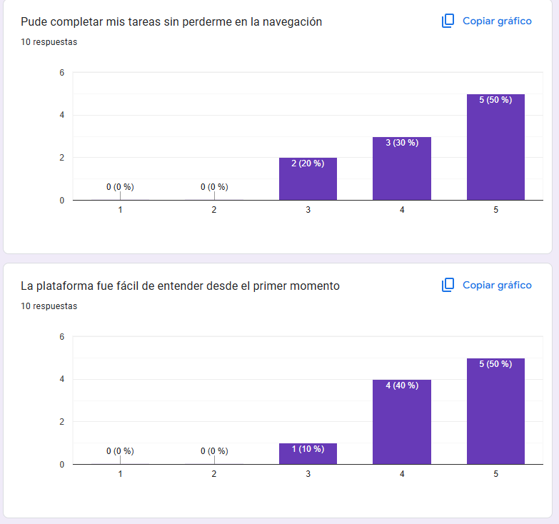

## Página 1 — [parte 1 formulario]
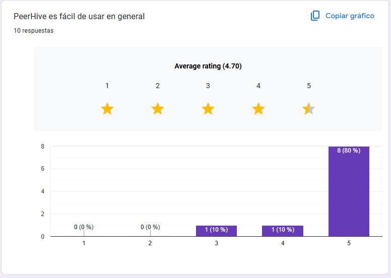

## Página 1 — [parte 1 formulario]
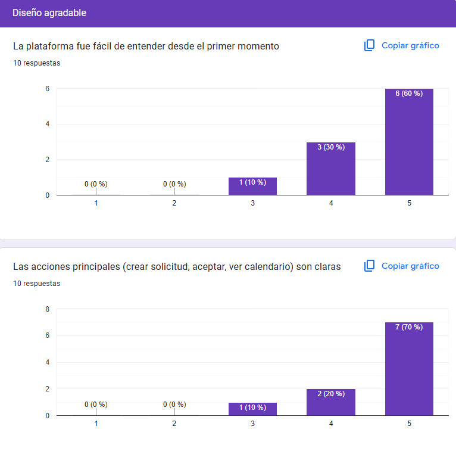

## Página 1 — [parte 1 formulario]
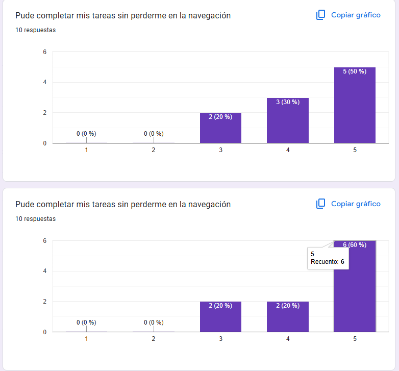

## Página 1 — [parte 1 formulario]
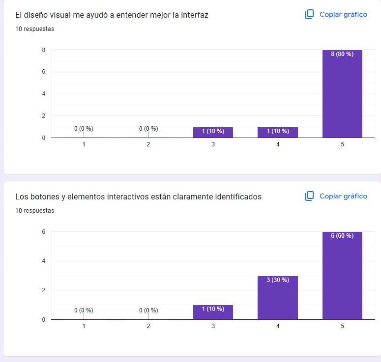

## Página 1 — [parte 1 formulario]
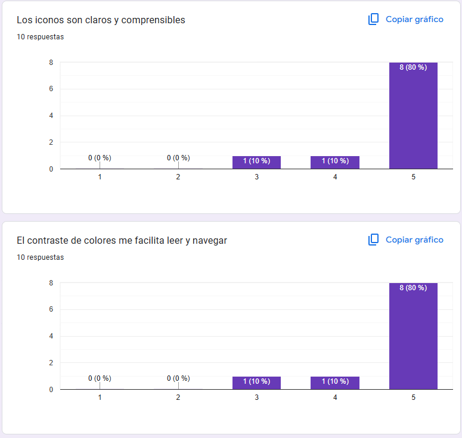

## Página 1 — [parte 1 formulario]
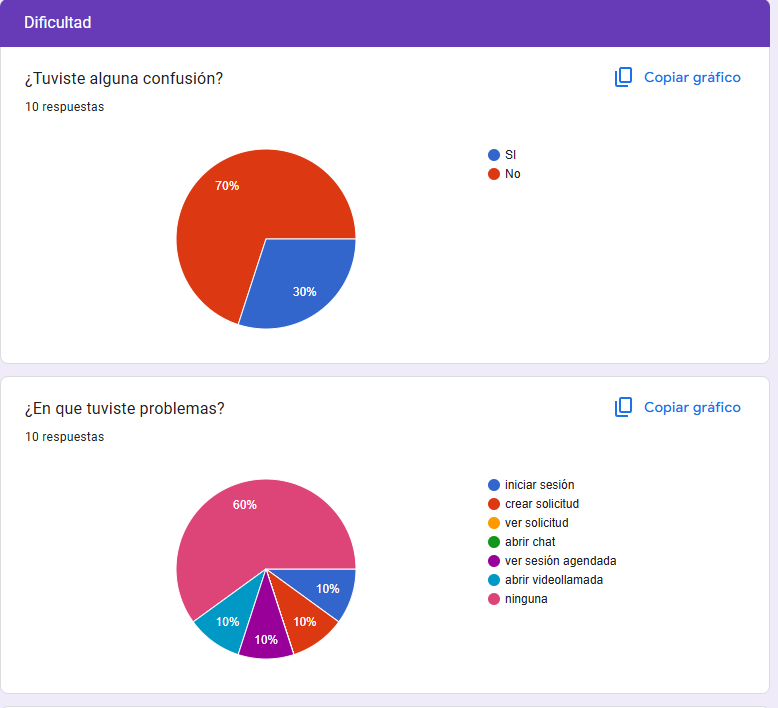

## Página 1 — [parte 1 formulario]
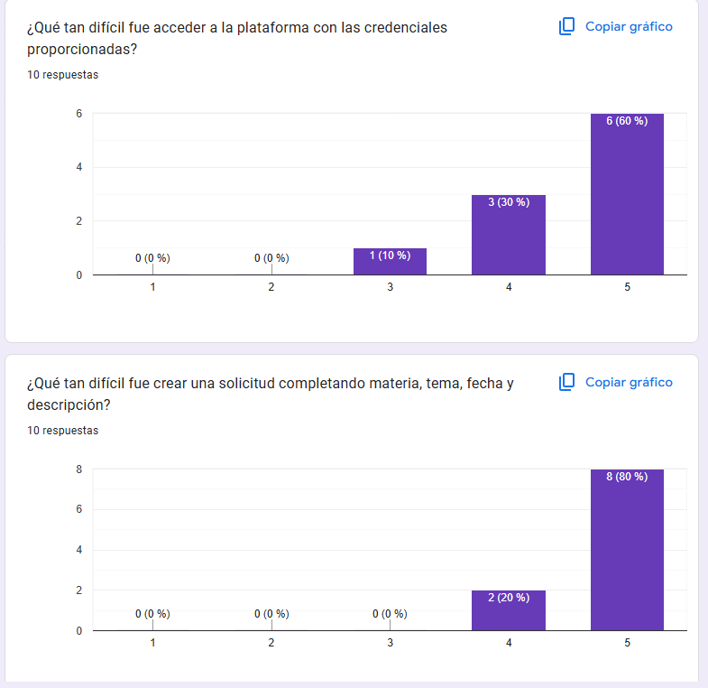

## Página 1 — [parte 1 formulario]
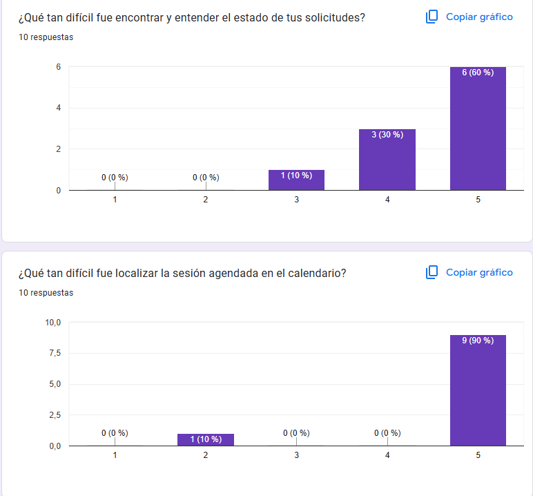

## Página 1 — [parte 1 formulario]
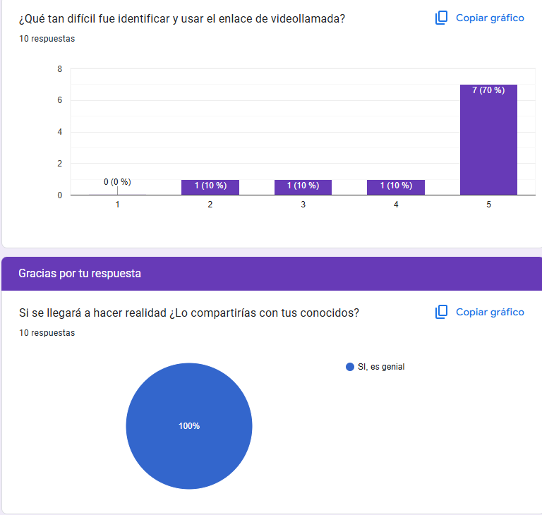