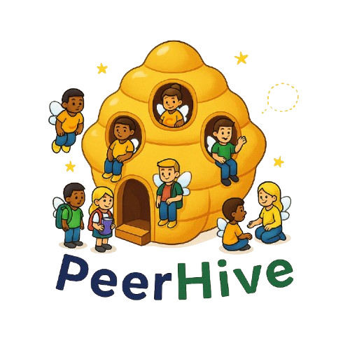

# 📌 Proyecto de Fundamentos de Software: PeerHive

  

<!-- Botón al branch main -->

  

---

# 📂 Tabla de Contenido
  

1- [📖 Producto](https://github.com/David-Alcocer/Equipo-6-Fundamentos-De-Software/tree/Segunda-Entrega-(Proyecto)/Producto%20%F0%9F%93%96)
  - [Descripción](https://github.com/David-Alcocer/Equipo-6-Fundamentos-De-Software/blob/Tercera-Entrega-(Proyecto)/Producto%20%F0%9F%93%96/Descripcion%20del%20producto.md)
  - [Usuario/cliente](https://github.com/David-Alcocer/Equipo-6-Fundamentos-De-Software/blob/Tercera-Entrega-(Proyecto)/Producto%20%F0%9F%93%96/Descripcion%20del%20producto.md)
  - [Objetivos](https://github.com/David-Alcocer/Equipo-6-Fundamentos-De-Software/blob/Tercera-Entrega-(Proyecto)/Producto%20%F0%9F%93%96/Objetivos.md)
  - [Propuesta de valor](https://github.com/David-Alcocer/Equipo-6-Fundamentos-De-Software/blob/Tercera-Entrega-(Proyecto)/Producto%20%F0%9F%93%96/Propuesta%20de%20valor.md)
  - [Cambios](https://github.com/David-Alcocer/Equipo-6-Fundamentos-De-Software/blob/Tercera-Entrega-(Proyecto)/Producto%20%F0%9F%93%96/Resumen%20de%20cambios.md)
 - [Evolución de producto](https://github.com/David-Alcocer/Equipo-6-Fundamentos-De-Software/blob/Tercera-Entrega-(Proyecto)/Producto%20📖/Evolución%20de%20Producto.md)
  
    
2- [💻 Requisitos](https://github.com/David-Alcocer/Equipo-6-Fundamentos-De-Software/tree/Tercera-Entrega-(Proyecto)/Requisitos%20%F0%9F%92%BB)
  - [Requisitos Funcionales](https://github.com/David-Alcocer/Equipo-6-Fundamentos-De-Software/blob/Tercera-Entrega-(Proyecto)/Requisitos%20%F0%9F%92%BB/Historias%20De%20Usario%20y%20RNF.md)
  - [Requisitos No Funcionales](https://github.com/David-Alcocer/Equipo-6-Fundamentos-De-Software/blob/Tercera-Entrega-(Proyecto)/Requisitos%20%F0%9F%92%BB/Historias%20De%20Usario%20y%20RNF.md)
  - [Priorización](https://github.com/David-Alcocer/Equipo-6-Fundamentos-De-Software/blob/Tercera-Entrega-(Proyecto)/Requisitos%20%F0%9F%92%BB/Priorizacion_MoSCoW_PeerHive.pdf)
  - [Diagrama de casos de uso](https://github.com/David-Alcocer/Equipo-6-Fundamentos-De-Software/blob/Tercera-Entrega-(Proyecto)/Requisitos%20%F0%9F%92%BB/Simple%20Use%20case%20diagram%20v2..pdf)
    
    
3- [📊 Proceso](https://github.com/David-Alcocer/Equipo-6-Fundamentos-De-Software/tree/Tercera-Entrega-(Proyecto)/Proceso%20%F0%9F%93%8A/Descripci%C3%B3n)
   - [Descripcion ](https://github.com/David-Alcocer/Equipo-6-Fundamentos-De-Software/blob/Tercera-Entrega-(Proyecto)/Proceso%20%F0%9F%93%8A/Descripci%C3%B3n/Descripci%C3%B3n.md)
   - [Métrica de contribución individual ](https://github.com/David-Alcocer/Equipo-6-Fundamentos-De-Software/blob/Tercera-Entrega-(Proyecto)/Gesti%C3%B3n/M%C3%A9trica%20de%20evaluaci%C3%B3n%20individual.md)
   - [Metodologia](https://github.com/David-Alcocer/Equipo-6-Fundamentos-De-Software/blob/Primera-Entrega-(Proyecto)/Producto%20📖/Artefactos/Metodologia%20de%20calificacion.pdf)
   - [Bitacora de reuniones ](https://github.com/David-Alcocer/Equipo-6-Fundamentos-De-Software/blob/Tercera-Entrega-(Proyecto)/Gesti%C3%B3n/Bit%C3%A1cora%20reuniones.md)

        
4- [🧑‍🏫 Presentación](https://github.com/David-Alcocer/Equipo-6-Fundamentos-De-Software/tree/Tercera-Entrega-(Proyecto)/Presentaci%C3%B3n%20%F0%9F%A7%91%E2%80%8D%F0%9F%8F%AB)
   - [Video](https://drive.google.com/file/d/1oZvyy39Sp3wUjwYSi_FrFHEpPWNvmTGK/view?usp=sharing)

5- [⭐ Competencias](https://github.com/David-Alcocer/Equipo-6-Fundamentos-De-Software/tree/Tercera-Entrega-(Proyecto)/Competencias%E2%AD%90)
   - [Genericas](https://github.com/David-Alcocer/Equipo-6-Fundamentos-De-Software/blob/Tercera-Entrega-(Proyecto)/Competencias%E2%AD%90/Competencias%20Genericas.md)
   - [Especificas](https://github.com/David-Alcocer/Equipo-6-Fundamentos-De-Software/blob/Tercera-Entrega-(Proyecto)/Competencias%E2%AD%90/Competencias%20Especificas.md)
   - [Critica constructiva](https://github.com/David-Alcocer/Equipo-6-Fundamentos-De-Software/blob/Tercera-Entrega-(Proyecto)/Competencias%E2%AD%90/Competencias%20Especificas.md)
   - [Actividades extra](https://github.com/David-Alcocer/Equipo-6-Fundamentos-De-Software/blob/Tercera-Entrega-(Proyecto)/Competencias%E2%AD%90/Competencias%20Especificas.md)
  - [Crítica Constructiva](https://github.com/David-Alcocer/Equipo-6-Fundamentos-De-Software/blob/Tercera-Entrega-(Proyecto)/Competencias⭐/Crítica%20Constructiva.md)

6- [Diseño](https://github.com/David-Alcocer/Equipo-6-Fundamentos-De-Software/tree/Tercera-Entrega-(Proyecto)/Design)
   - [Mock up](https://peerhive-app.netlify.app/)
   - [wireframes](https://github.com/David-Alcocer/Equipo-6-Fundamentos-De-Software/tree/Tercera-Entrega-(Proyecto)/Design/wireframes%20base)
   - [prototipo 1](https://www.figma.com/proto/MzYcOXkX42vubYmrf3KQvW/dise%C3%B1o?page-id=7%3A513&node-id=11-24233&viewport=500%2C1206%2C0.23&t=8v1bpaNZFSRvojwA-1&scaling=scale-down&content-scaling=fixed&starting-point-node-id=11%3A24233)
   - [Analisis de comentarios](https://github.com/David-Alcocer/Equipo-6-Fundamentos-De-Software/blob/Tercera-Entrega-(Proyecto)/Design/Recoleccion%20de%20comentarios/Formulario%20de%20recoleccion%20de%20comentarios/Resumen%20de%20la%20recoleccion.md)
   - [Comentarios](https://github.com/David-Alcocer/Equipo-6-Fundamentos-De-Software/tree/Tercera-Entrega-(Proyecto)/Design/Recoleccion%20de%20comentarios/Formulario%20de%20recoleccion%20de%20comentarios)
   - [Validacion](https://github.com/David-Alcocer/Equipo-6-Fundamentos-De-Software/blob/Tercera-Entrega-(Proyecto)/Design/Validacion-del-cliente.md)
   - [codigo](https://github.com/David-Alcocer/Equipo-6-Fundamentos-De-Software/tree/Tercera-Entrega-(Proyecto)/Design/Artefactos%20de%20codigo)

7- [Pruebas](https://github.com/David-Alcocer/Equipo-6-Fundamentos-De-Software/tree/Tercera-Entrega-(Proyecto)/Pruebas)
   - [Resultados estudiantes](https://github.com/David-Alcocer/Equipo-6-Fundamentos-De-Software/blob/Tercera-Entrega-(Proyecto)/Pruebas/Reporte%20de%20pruebas.md)
   - [Resultados asesores ](https://github.com/David-Alcocer/Equipo-6-Fundamentos-De-Software/blob/Tercera-Entrega-(Proyecto)/Pruebas/Reporte%20de%20pruebas%20asesores.md)
   - [Encuestas](https://github.com/David-Alcocer/Equipo-6-Fundamentos-De-Software/blob/Tercera-Entrega-(Proyecto)/Pruebas/Encuestas.md)
   - [evidencias](https://github.com/David-Alcocer/Equipo-6-Fundamentos-De-Software/blob/Tercera-Entrega-(Proyecto)/Pruebas/Evidencia%20de%20pruebas.md)
   
---
## 🌿 Ramas por Entrega

| Entrega | Rama | Enlace |
|---|---|---|
| Primera | `Primera-Entrega-(Proyecto)` | [Ver rama](https://github.com/David-Alcocer/Equipo-6-Fundamentos-De-Software/tree/Primera-Entrega-(Proyecto)) |
| Segunda | `Segunda-Entrega-(Proyecto)` | [Ver rama](https://github.com/David-Alcocer/Equipo-6-Fundamentos-De-Software/tree/Segunda-Entrega-(Proyecto)) |
| Tercera | `Tercera-Entrega-(Proyecto)` | [Ver rama](https://github.com/David-Alcocer/Equipo-6-Fundamentos-De-Software/tree/Tercera-Entrega-(Proyecto)) |

  <a href="https://github.com/David-Alcocer/Equipo-6-Fundamentos-De-Software/tree/main" target="_blank" rel="noopener">Main</a> ·
  <a href="https://github.com/David-Alcocer/Equipo-6-Fundamentos-De-Software/tree/Primera-Entrega-(Proyecto)">Primera</a> ·
  <a href="https://github.com/David-Alcocer/Equipo-6-Fundamentos-De-Software/tree/Segunda-Entrega-(Proyecto)">Segunda</a> ·
  <a href="https://github.com/David-Alcocer/Equipo-6-Fundamentos-De-Software/tree/Tercera-Entrega-(Proyecto)">Tercera</a>

---

## 🙋 Contribuidores

| Foto | Rol |
| :---: | :--- |
|  | David Misael Alcocer Castilla: En el equipo asumo la responsabilidad de checar los requerimientos. Analizo y superviso la tarea de mis compañeros para ver si necesitan mejorar. Además de ser dueño del repositorio y estar pendiente de los pull request de mis compañeros. |
|  | Leo Ariel San Martin López: En el equipo asumo la responsabilidad de scrum master, product owner y líder de equipo, resolviendo la mayor parte de los blockers del equipo. |
|  | Alam Javier Toache Várguez: Durante el trabajo del equipo me encargo de la organización del repositorio, ayudo en la parte creativa así como también en el desarrollo de artefactos. |
|  | Rodrigo Israel Salazar Pérez: En el proyecto asumo la responsabilidad de redacción y chequeo de los mock up para que pueda cumplir con su cometido , al igual que me involucro en la corrección de erroes en el proyecto.

