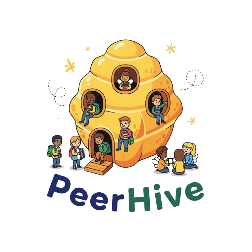

# Equipo-6-Fundamentos-De-Software
Repository about Software Fundament 

# 📌 Proyecto de Fundamentos de Software: PeerHive

---
# 📂 Tabla de Contenido
  
1- [📖 Producto](https://github.com/David-Alcocer/Equipo-6-Fundamentos-De-Software/tree/Primera-Entrega-(Proyecto)/Producto%20%F0%9F%93%96)
  - [Descripción](https://github.com/David-Alcocer/Equipo-6-Fundamentos-De-Software/blob/Primera-Entrega-(Proyecto)/Producto%20%F0%9F%93%96/Descripcion%20del%20producto.md)
  - [Usuario/cliente](https://github.com/David-Alcocer/Equipo-6-Fundamentos-De-Software/blob/Primera-Entrega-(Proyecto)/Producto%20%F0%9F%93%96/Descripcion%20del%20producto.md)
  - [Objetivos](https://github.com/David-Alcocer/Equipo-6-Fundamentos-De-Software/blob/Primera-Entrega-(Proyecto)/Producto%20%F0%9F%93%96/Objetivos.md)
  - [Propuesta de valor](https://github.com/David-Alcocer/Equipo-6-Fundamentos-De-Software/blob/Primera-Entrega-(Proyecto)/Producto%20%F0%9F%93%96/Propuesta%20de%20valor.md)
    
 
2- [💻 Requisitos](https://github.com/David-Alcocer/Equipo-6-Fundamentos-De-Software/tree/Primera-Entrega-(Proyecto)/Requisitos%20%F0%9F%92%BB)
  - [Requisitos Funcionales](https://github.com/David-Alcocer/Equipo-6-Fundamentos-De-Software/blob/Primera-Entrega-(Proyecto)/Producto%20📖/Artefactos/Requerimientos%20Funciones%20P1.pdf)
  - [Requisitos No Funcionales](https://github.com/David-Alcocer/Equipo-6-Fundamentos-De-Software/blob/Primera-Entrega-(Proyecto)/Producto%20📖/Artefactos/Requerimientos%20No-Funcionales%20P1.pdf)
  - [Priorización](https://github.com/David-Alcocer/Equipo-6-Fundamentos-De-Software/blob/Primera-Entrega-(Proyecto)/Producto%20📖/Artefactos/Priorización%20P1.pdf)
    
    
3- [📊 Proceso](https://github.com/David-Alcocer/Equipo-6-Fundamentos-De-Software/tree/Primera-Entrega-(Proyecto)/Proceso%20%F0%9F%93%8A)
   - [Descripcion ](https://github.com/David-Alcocer/Equipo-6-Fundamentos-De-Software/blob/Primera-Entrega-(Proyecto)/Proceso%20📊/Descripción/Descripción.md)
   - [Métrica de contribución individual ](https://github.com/David-Alcocer/Equipo-6-Fundamentos-De-Software/blob/Primera-Entrega-(Proyecto)/Gesti%C3%B3n/M%C3%A9trica%20de%20evaluaci%C3%B3n%20individual.md)
   - [Metodologia](https://github.com/David-Alcocer/Equipo-6-Fundamentos-De-Software/blob/Primera-Entrega-(Proyecto)/Producto%20📖/Artefactos/Metodologia%20de%20calificacion.pdf)
   - [Bitacora de reuniones ](https://github.com/David-Alcocer/Equipo-6-Fundamentos-De-Software/blob/Primera-Entrega-(Proyecto)/Producto%20📖/Artefactos/Metodologia%20de%20calificacion.pdf)

        
    
4- [🧑‍🏫 Presentación](https://github.com/David-Alcocer/Equipo-6-Fundamentos-De-Software/tree/Primera-Entrega-(Proyecto)/Presentaci%C3%B3n%20%F0%9F%A7%91%E2%80%8D%F0%9F%8F%AB)
   - [Video](https://alumnosuady-my.sharepoint.com/:v:/g/personal/a25216404_alumnos_uady_mx/Eb3M4opRfvhIvZQ1o-m7JqEBtfg23gQ9TrQ2Ge-9Rr76Og?nav=eyJyZWZlcnJhbEluZm8iOnsicmVmZXJyYWxBcHAiOiJPbmVEcml2ZUZvckJ1c2luZXNzIiwicmVmZXJyYWxBcHBQbGF0Zm9ybSI6IldlYiIsInJlZmVycmFsTW9kZSI6InZpZXciLCJyZWZlcnJhbFZpZXciOiJNeUZpbGVzTGlua0NvcHkifX0&e=lgGaRf)

     
 
5- [⭐ Competencias](https://github.com/David-Alcocer/Equipo-6-Fundamentos-De-Software/tree/Primera-Entrega-(Proyecto)/Competencias%E2%AD%90)
   - [Genericas](https://github.com/David-Alcocer/Equipo-6-Fundamentos-De-Software/blob/Primera-Entrega-(Proyecto)/Competencias⭐/Competencias%20Genericas.md)
   - [Especificas](https://github.com/David-Alcocer/Equipo-6-Fundamentos-De-Software/blob/Primera-Entrega-(Proyecto)/Competencias⭐/Competencias%20Especificas.md)
6- [Gestión](https://github.com/David-Alcocer/Equipo-6-Fundamentos-De-Software/tree/Primera-Entrega-(Proyecto)/Gestión)
 
 
- [🙋 Contribuidores]()

| Foto | Rol |
| :---: | :--- |
<<<<<<< HEAD
|| En el equipo asumo la responsabilidad de checar los requisitos y analizar y supervisar la tarea de mis comapñeros para ver si necesitan mejorar |
=======

|| En el equipo asumo la responsabilidad de scrum master, product owner y lider de equipo, resolviendo la mayor parte de los blockers del equipo | 
>>>>>>> 39177e03e9ae585572a870a689454af58ca9ab16
